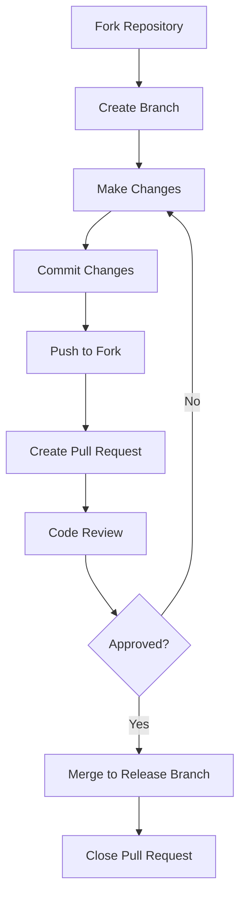
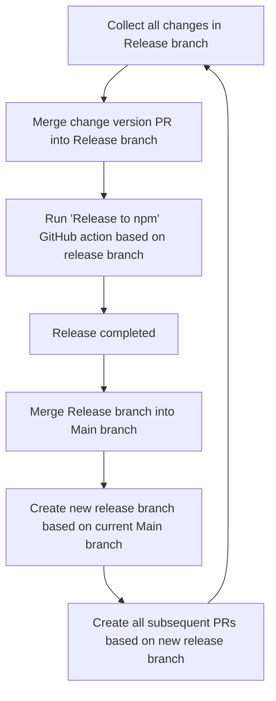

# Contribution Guide

Thank you for contributing to this project. Below is a detailed guide on the contribution process.

## Contribution Process

The following diagram shows the overall flow of the contribution process:

## Deployment

Release branch is deployed to production environment automatically when merged.

- version PR: PR that updates the version in package.json
- Use `pnpm changeset` to create a new version
  - `pnpm changeset` will create a new version PR based on the release branch
    - patch: bug fix
    - minor: new feature
    - major: breaking change

## Branch Naming

- `feature/*`: New feature development
- `fix/*`: Bug fix
- `chore/*`: Chore (refactoring, documentation, etc.)
- `docs/*`: Documentation
- `style/*`: Style (formatting, linting, etc.)
- `refactor/*`: Refactoring (code improvement, no new feature or bug fix)
- `test/*`: Testing
- `ci/*`: CI/CD (continuous integration and continuous deployment)

## Commit Message Format

- Use the present tense ("Add feature" not "Added feature")
- Use the imperative mood ("Move cursor to..." not "Moves cursor to...")
- Limit the first line to 72 characters or less
- Reference issues and pull requests liberally after the first line

## Code Review

- All PRs require at least one review approval before merging
- Squash commits before merging
- Rebase before merging to keep the commit history clean
